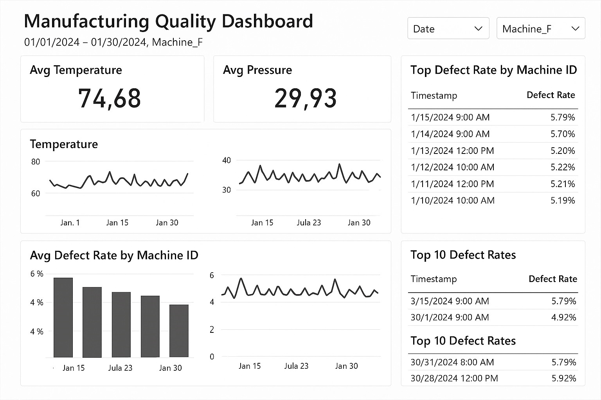

#  Manufacturing Quality Dashboard

A comprehensive smart factory monitoring solution that provides real-time insights into production quality metrics. Built with Python for data simulation, SQLite for efficient data storage, and Power BI for interactive business intelligence dashboards.



##  Overview

This project simulates a modern manufacturing environment where production machines are continuously monitored for quality assurance. The dashboard tracks critical metrics including temperature, pressure, and defect rates to identify trends, anomalies, and optimization opportunities.

##  Technology Stack

| Technology | Purpose |
|------------|---------|
| **Python** | Data simulation, automation, and backend processing |
| **SQLite** | Lightweight database for sensor data storage |
| **Power BI** | Interactive dashboard and business intelligence |
| **DAX** | Advanced calculations and KPI formulations |

##  Key Features

###  Analytics & Insights
- **Real-time KPIs** - Track average temperature, pressure, and defect rates
- **Trend Analysis** - Historical performance charts with time-series visualization
- **Comparative Analysis** - Machine-to-machine defect rate comparisons
- **Anomaly Detection** - Highlighted outliers and quality issues

###  Interactive Controls
- **Date Range Filters** - Focus on specific time periods
- **Machine Selectors** - Drill down to individual equipment performance
- **Dynamic Data Tables** - Sortable views of critical events

###  Visual Components
- Line charts for trend monitoring
- Bar charts for performance comparison  
- KPI cards for at-a-glance metrics
- Data tables for detailed analysis

##  Project Structure

```
manufacturing-quality-dashboard/
│
├──  Dashboard.png                    # Dashboard preview screenshot
├──  LICENSE                          # MIT License
├──  README.md                        # Project documentation
├──  manufacturing_dashboard_template.pbix  # Power BI template file
├──  sensor_data.db                  # SQLite database (generated)
└──  simulate_sensor_data.py          # Data simulation script
```

##  Quick Start Guide

### Prerequisites
- Python 3.7 or higher
- Power BI Desktop
- SQLite (included with Python)

### Step 1: Generate Sample Data
```bash
# Clone the repository
git clone [[your-repo-url]](https://github.com/YOUR_USERNAME/manufacturing-quality-dashboard)
cd manufacturing-quality-dashboard

# Run the simulation script
python simulate_sensor_data.py
```
*This creates `sensor_data.db` with 30 days of synthetic sensor readings across 5 production machines.*

### Step 2: Configure Power BI
1. Open `manufacturing_dashboard_template.pbix` in Power BI Desktop
2. If prompted, update the data source connection:
   - Navigate to **Home** → **Transform Data** → **Data Source Settings**
   - Select **Change Source** and point to your `sensor_data.db` file
3. Refresh the data to load the simulated sensor readings

### Step 3: Explore & Analyze
- Use date slicers to focus on specific time periods
- Filter by machine to analyze individual equipment performance
- Identify correlations between temperature, pressure, and defect rates
- Export insights or publish to Power BI Service for team sharing

##  Business Applications

### Quality Control
Monitor production quality in real-time to minimize waste and ensure product standards are maintained consistently across all manufacturing lines.

### Predictive Maintenance  
Identify equipment performance patterns that may indicate upcoming maintenance needs, reducing unexpected downtime and repair costs.

### Operational Efficiency
Compare machine performance to optimize production schedules and identify high-performing equipment configurations.

### Compliance & Reporting
Generate automated reports for quality audits and regulatory compliance documentation.

##  Sample Insights

The dashboard reveals several key manufacturing insights:

- **Temperature-Pressure Correlation**: Higher operating temperatures often coincide with increased pressure readings
- **Quality Patterns**: Defect rates tend to spike during certain operational conditions
- **Machine Performance**: Equipment #3 consistently shows the lowest defect rates
- **Time-based Trends**: Quality metrics vary throughout different periods

##  Customization Options

### Extending the Data Model
- Add new sensor types (humidity, vibration, speed)
- Include shift/operator information
- Incorporate material batch tracking

### Advanced Analytics
- Implement statistical process control (SPC) charts
- Add machine learning-based anomaly detection
- Create predictive quality scoring

### Integration Possibilities
- Connect to real industrial IoT sensors
- Export data to ERP systems
- Set up automated alert notifications

##  Future Enhancements

- [ ] Real-time data streaming integration
- [ ] Machine learning predictive models
- [ ] Mobile dashboard responsiveness
- [ ] Automated alert system
- [ ] Multi-site manufacturing support
- [ ] Advanced statistical process control

##  License

This project is licensed under the MIT License - see the [LICENSE](LICENSE) file for details.

##  Author

**Seyed Hassani**
- GitHub: [GitHub Profile]https://github.com/seyed-hassani
- LinkedIn: [LinkedIn Profile]https://www.linkedin.com/in/seyed-hassani/

